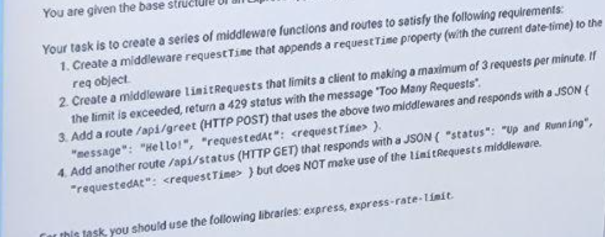

# HW 7 solve challenge described on the attached screenshot from exam
In the express-rate-limit third party middleware you may use only fields (see documentation) that you logically understand windowMs, limit and message